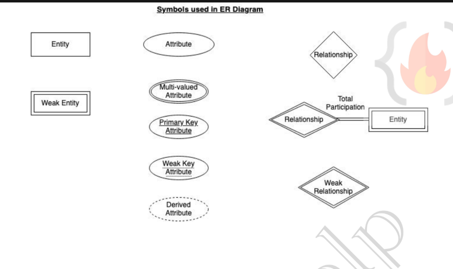

# Data Models
Collection of conceptual tools for describing data, data relationships, data semantics, and consistency constraints.
types-er,relational,hierachial,network

# ER MODEL
The full form of er model is entity-relationship model.The Entity-Relationship (ER) Model is a high-level conceptual data model used to design databases. It represents data using entities, attributes, and relationships.
Graphical representation of ER Model is ER diagram, which acts as a blueprint of DB.

### Entity
An Entity is a real-world object or thing about which data is stored.
Examples
Student
Employee
Course
Department
In an er diagram entity is representated using rectangle
Entity can be uniquely identified. (By a primary attribute, aka Primary Key)

**Strong Entity**:Can be uniquely identified
**Weak Entity**:Can't be uniquely identified depends on some other entity.It doesn’t have sufficient attributes, to select a uniquely identifiable attribute.Loan -> Strong Entity, Payment -> Weak, as instalments are sequential number counter can be generated
separate for each loan.W*eak entity depends on strong entity for existence.

### Entity Set
It is a set of entities of the same type that share the same properties, or attributes.
 E.g., Student is an entity set.E.g., Customer of a bank

### Attribute
An Attribute is a property or characteristic of an entity.
**Domain**-For each attribute there is set of permitted values called domain or value set
E.g., Student Entity has following attributes
A. Student_ID
B. Name
C. Standard
D. Course
E. Batch
F. Contact number
G. Address

## Types of attribute

**Simple**-Cannot be divided further.
Example:
Age
Gender

**Composite**-an be divided into smaller parts.
Example:
Address → House No, Street, City

**Single Valued**-Has only one value.
Example:
Date of Birth

**Multi-Valued Attribute**-Can have multiple values.
Example:
Phone Numbers

**Derived**-Obtained from another attribute.
Example:
Age derived from Date of Birth

**Null**-An attribute takes a null value when an entity does not have a value for it.
 It may indicate “not applicable”, value doesn’t exist. e.g., person having no middle-name
 It may indicate “unknown”.
 Unknown can indicate missing entry, e.g., name value of a customer is NULL, means it is missing as name
must have some value.
 Not known, salary attribute value of an employee is null, means it is not known yet.

## Realtionships
A Relationship represents an association between entities.
Example:
Student ----- Studies ----- Course
studies is a relation
In ER diagrams, relationships are represented by a diamond.
**Strong relationships**- between two independent entities.
**Weak relationships**-between weak entity and its owner/strong entity.Eg e.g., Loan <instalment-payments> Payment.

### Degree of relationship
Number of entities participating in a relationship
**Unary**-Only one entity participates.Eg Employee manages employee
**Binary**-Two entities particpates.Eg Student takes COurse
**Ternary**-Three entities particpates.Eg Employee works on branch employee works on job

## Relationship Constraints
Relationship Constraints specify how entities participate in a relationship and how many entities can be associated with another entity

### Mapping Cardinalities
These specify the number of entities that can participate in a relationship.

#### One to One
One entity of set A is related to at most one entity of set B, and vice versa.
Example:
Person ─── Has ─── Passport
One person → One passport
One passport → One person

#### One to Many
One entity of set A can be related to many entities of set B.
xample:
Department ─── Contains ─── Students
One department → Many students
One student → One department

#### Many-to-One (N:1)
Many entities of set A can be related to one entity of set B.
exmple:
Students ─── Belong To ─── Department
Many students → One department

#### Many-to-Many (M:N)
Many entities of set A can be related to many entities of set B.
Example:
Students ─── Enroll ─── Courses
One student → Many courses
One course → Many students

### Participation Constraints
These specify whether the participation of an entity in a relationship is mandatory or optional.

#### Total Participation
Every entity must participate in the relationship.
Example:
Employee ─── Works_For ─── Company
If every employee must work for a company, participation is total.
Represented by a double line in ER diagrams.

#### ) Partial Participation
Some entities may or may not participate in the relationship.
Example:
Customer ─── Owns ─── Car
Not every customer owns a car.
Represented by a single line in ER diagram

Weak entity has total participation constraint, but strong may not have total.

## ER NOTATIONS:

