# Relational Data Model
The Relational Data Model is the most widely used data model in DBMS. It organizes data into tables (relations) consisting of rows and columns.
It was proposed by Edgar F. Codd in 1970.
A relational DB consists of collection of tables, each of which is assigned a unique name.

## Relation(Table)
A relation is a table that stores data.
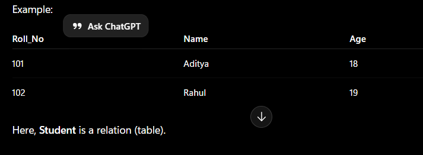

## Columns
It represents the attributes of the relation. Each attribute, there is a permitted value, called domain of the
attribute.
Example:
Roll_No	Name	Age
Roll_No
Name
Age are attributes.

## Row
A row in a table represents a relationship among a set of values, and table is collection of such relationships.

## Tuple
Tuple: A single row of the table representing a single data point / a unique record.

## Relation Schema
A Relation Schema describes the structure (blueprint) of a relation (table). It specifies:
Relation (table) name
Attributes (columns)
Data items stored in the table
It does not contain the actual data.

General Form:
Relation_Name(Attribute1, Attribute2, Attribute3, ...)

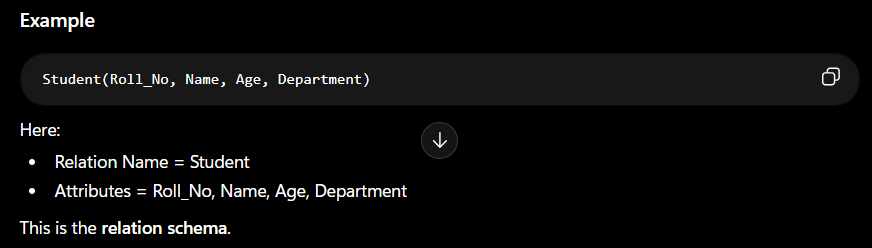

**Common RM based DBMS systems, aka RDBMS: Oracle, IBM, MySQL, MS Access.**

## Degree
The number of attributes (columns) in a relation.
Example:
Roll_No	Name	Age
Degree = 3

## Cardinality
The number of tuples (rows) in a relation.
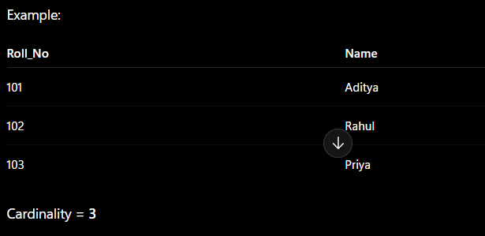

## Properties of tables
- The name of relation is distinct among all other relation.
- The values have to be atomic. Can’t be broken down further.
- The name of each attribute/column must be unique.
- Each tuple must be unique in a table.
- The sequence of row and column has no significance.
- Tables must follow integrity constraints - it helps to maintain data consistency across the tables.

## Relational Keys
Set of attribute which can uniquely identify each tuple

## Relational Model keys

### Super Key 
A Super Key is any set of one or more attributes that can uniquely identify a row.
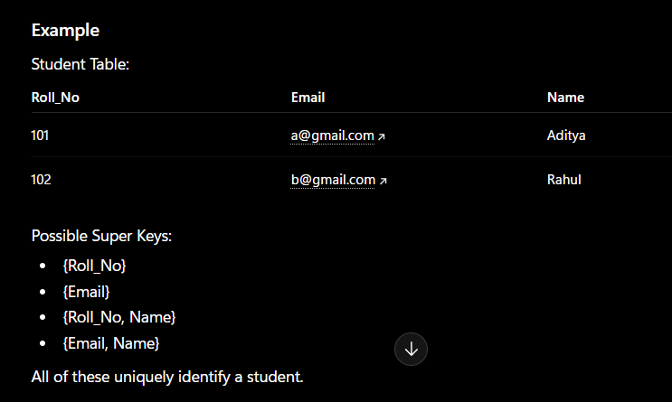

### Candidate Key
A Candidate Key is a minimal Super Key.
It uniquely identifies rows.
No attribute can be removed from it.
No redudant attributes
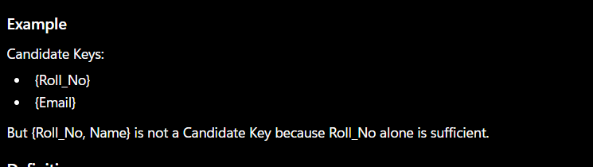

### Primary Key
A Primary Key is the selected Candidate Key used to uniquely identify each record in a table.

### Alternate Key
Candidate Keys not selected as the Primary Key are called Alternate Keys.
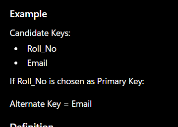

### Foreign Key
A Foreign Key is an attribute that establishes a relationship between two tables by referencing the Primary Key of another table.
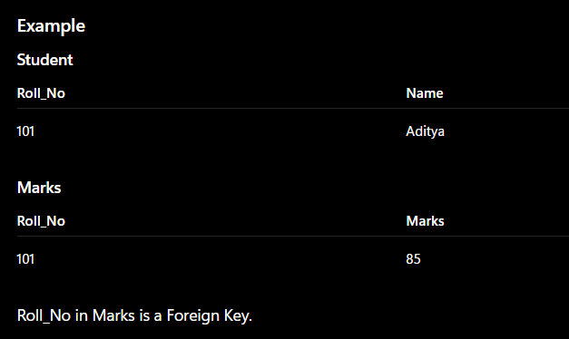

### Composite Key
A Composite Key is a key made up of multiple attributes that together uniquely identify a tuple
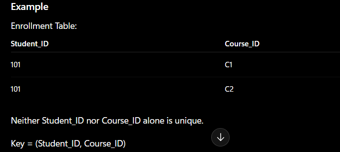

### Compound Key
A Compound Key is a key consisting of two or more attributes used together for unique identification.

### Surrogate Key
A Surrogate Key is a system-generated unique identifier used as a Primary Key.
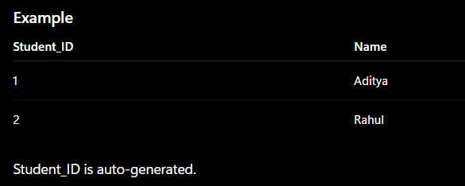

## Integrity Constraints
**What are Integrity Constraints?**
Rules that ensure the accuracy, consistency, and validity of data in a database.
Prevent accidental corruption of the database.
Ensure CRUD (Create, Read, Update, Delete) operations maintain database consistency.

### Domain Constraints
Restrict the values that can be stored in an attribute.
Define the domain (allowed values) of an attribute.
Restrict data types and valid ranges.
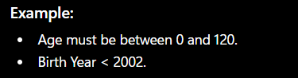

### Entity Integrity Constraint
Every relation (table) must have a Primary Key (PK).
Primary Key cannot be NULL.
Ensures every record can be uniquely identified

## Referential Integrity Constraint
Maintains consistency between two related tables.
A Foreign Key (FK) value must:
Match an existing Primary Key (PK) in the parent table, OR
Be NULL.
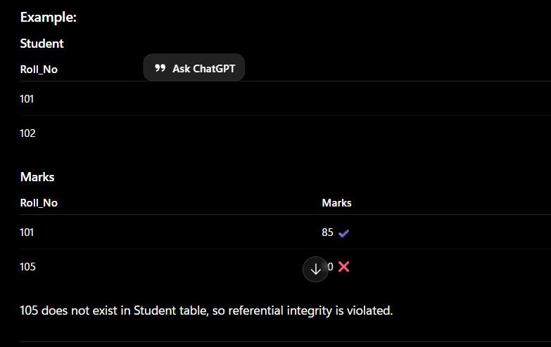

## Key Constraints
### NOT NULL
Attribute cannot contain NULL values.
eg Name VARCHAR(50) NOT NULL

### UNIQUE
All values in the column must be different.
eg Email VARCHAR(50) UNIQUE

### DEFAULT
Assigns a default value if no value is provided.
eg City VARCHAR(20) DEFAULT 'Kolkata'

### CHECK
Restricts values based on a condition.
eg Age INT CHECK (Age >= 18)

### PRIMARY KEY
Uniquely identifies each row.
Must be UNIQUE and NOT NULL.
Eg Roll_No INT PRIMARY KEY

### FOREIGN KEY
Creates a relationship between two tables.
References the Primary Key of another table.
eg FOREIGN KEY (Roll_No)
REFERENCES Student(Roll_No)
