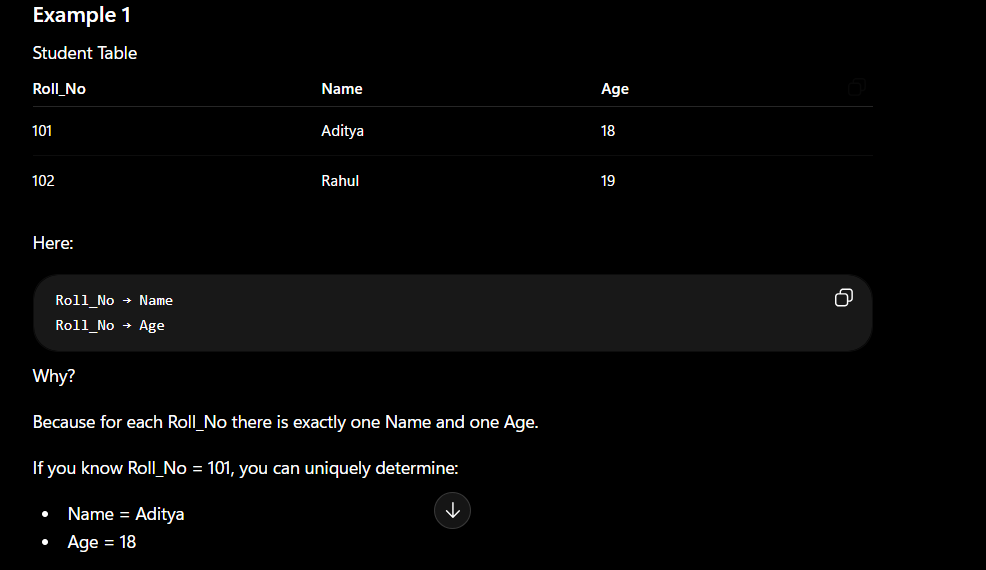
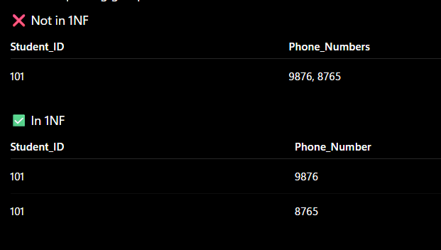
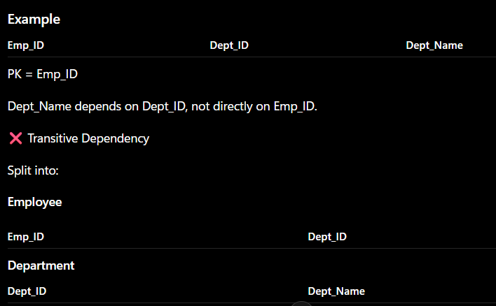
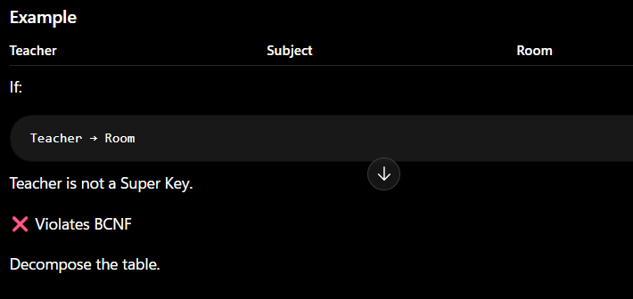

# Normalisation
Normalisation is a step towards DB optimisation.

## Functional Dependency
A functional dependency exists when the value of one attribute uniquely determines the value of another attribute.

It is represented as:
X → Y
Read as x determines y or y is functionally dependent on x

Example:

### Types

## Trivial:
When the RHS is a subset of the LHS.
{A, B} → A
{A, B} → B
Example:
(Student_ID, Name) → Name
This is always true.

## Non Trivial:
When RHS is not a subset of LHS
Student_ID → Name
Here Name is not part of Student_ID.

## Rules of FD (Armstrong Axioms)
**Reflexive**-If Y is a subset of X, then:
X → Y
Example
If:
X = {A, B}
Y = {A}
Then:
(A, B) → A
✅ Always true

**Augmentation**-If:X → Y
Then for any attribute Z:
XZ → YZ
Example
If:
Student_ID → Name
Then:
(Student_ID, Course_ID)
→
(Name, Course_ID)

**Transitive**-If:
X → Y
Y → Z
Then:
X → Z
Example
Roll_No → Dept_ID
Dept_ID → Dept_Name
Therefore:
Roll_No → Dept_Name

### Why Normalisation ?
To avoid redundancy in DB and not to store redundant data in Db we use normalisation

### What happens when we have redudant data ?
Insertion,deletion,updation anamolies arises

### Anamolies
Anamolies means abnormalities,there are three types of anamolies
**Insertion**-When certain data (attribute) can not be inserted into the DB without the presence of other data.
**Deletion**-The delete anomaly refers to the situation where the deletion of data results in the unintended loss of some
other important data.
**Updation**-The update anomaly is when an update of a single data value requires multiple rows of data to be updated.
2Due to updation to many places, may be Data inconsistency arises, if one forgets to update the data at all the intended places.

**Due to this anamolies DB size increases and DB performance becomes very low**
***To rectify these anomalies and the effect of these of DB, we use Database optimisation technique called NORMALISATION.***

## Normalisation
Normalization is the process of organizing data in a database to:
Reduce data redundancy (duplicate data)
Eliminate anomalies (Insertion, Update, Deletion)
Improve data consistency and integrity

## Types:

## 1NF (First Normal Form)
Each cell contains only one value.
No repeating groups or multivalued attributes.

## 2NF (Second Normal Form)
Must be in 1NF.
No Partial Dependency.
A non-key attribute should depend on the entire primary key, not part of it.

## 3NF (Third Normal Form)
Must be in 2NF.
No Transitive Dependency.
Non-key attributes should depend only on the Primary Key.

## BCNF (Boyce-Codd Normal Form)
For every dependency:
X → Y
X must be a Super Key.
BCNF is a stricter version of 3NF.

## Advantages of Normalisation
- Normalisation helps to minimise data redundancy.
- Greater overall database organisation.
- Data consistency is maintained in DB.
