# Transaction
A Transaction is a sequence of one or more database operations that are treated as a single logical unit of work.
A transaction must be completed entirely or not executed at all.Sequence is very important in transaction.
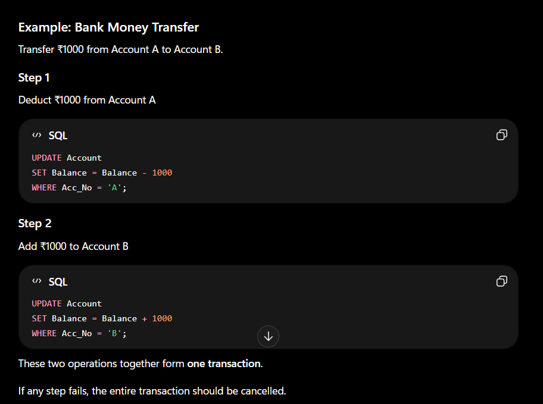

## ACID PROPERTIES
ACID is a set of four properties that ensure transactions are processed reliably and correctly in a database.
A → Atomicity
C → Consistency
I → Isolation
D → Durability

### ATOMICITY
A transaction must be completed fully or not executed at all.
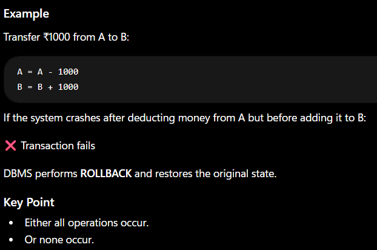

### CONSISTENCY
A transaction must take the database from one valid state to another valid state.
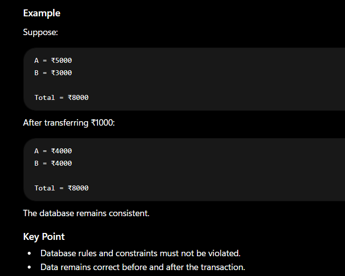

### ISOLATION
Multiple transactions executing simultaneously should not interfere with each other.
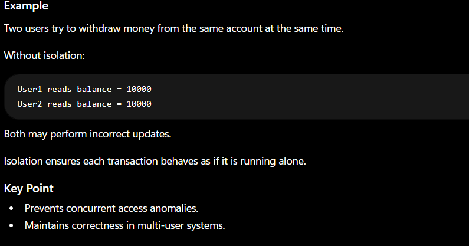

### DURABILITY
Once a transaction is COMMITTED, its changes become permanent.
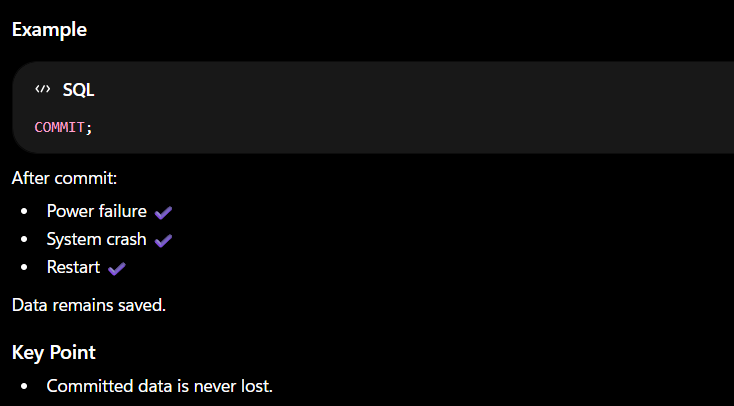

## Transaction States
A transaction state represents the current status of a transaction during its execution, from the time it starts until it successfully completes or fails.

### Active State
The transaction is currently executing its read and write operations
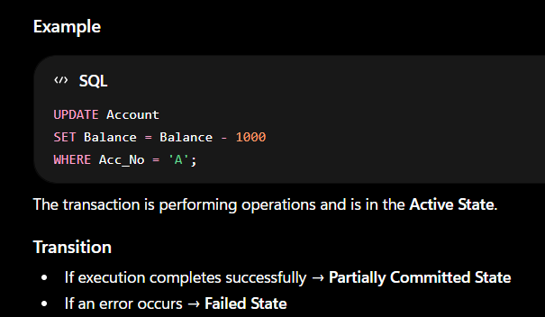

### Partially Committed State
The transaction has executed all its operations, but the changes are not yet permanently saved in the database.
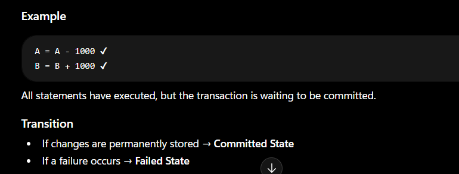

### Commited State
The transaction has completed successfully and all changes have been permanently saved in the database.
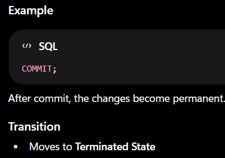

### Failed State
The transaction cannot continue because of an error, crash, hardware failure, software failure, or integrity constraint violation.
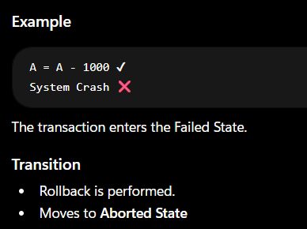

### Aborted State
The transaction has been rolled back, and all changes made by it have been undone.
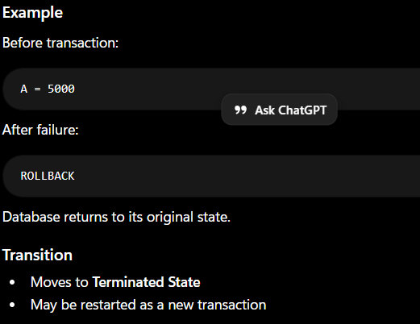

### Terminated State
The transaction has finished execution and leaves the system.
A transaction reaches this state after:
Successful Commit, or
Abort/Rollback
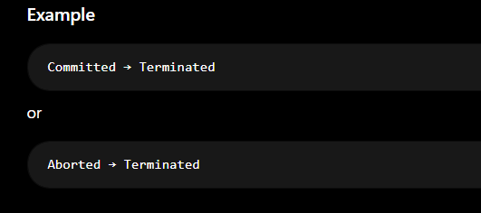

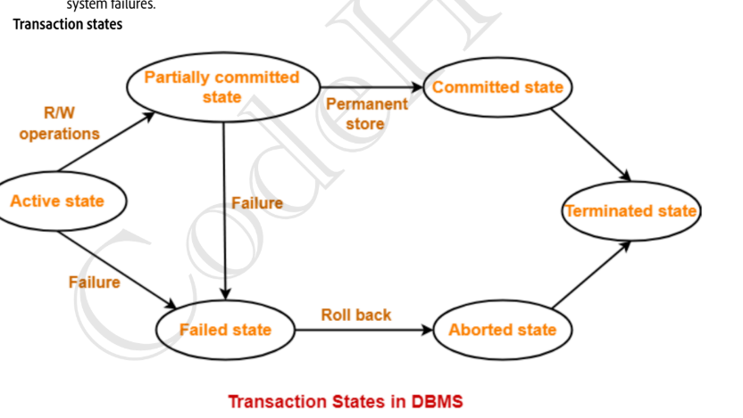

