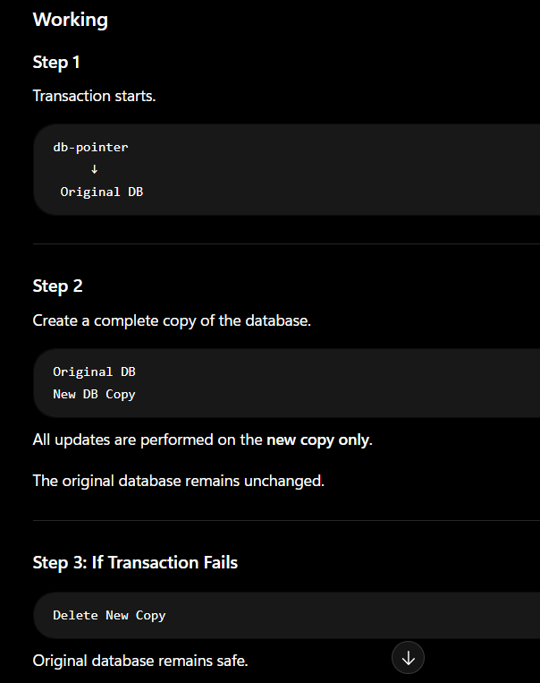
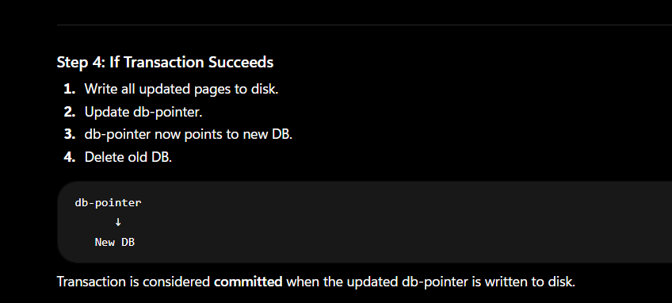
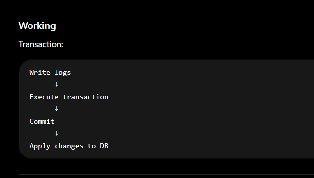
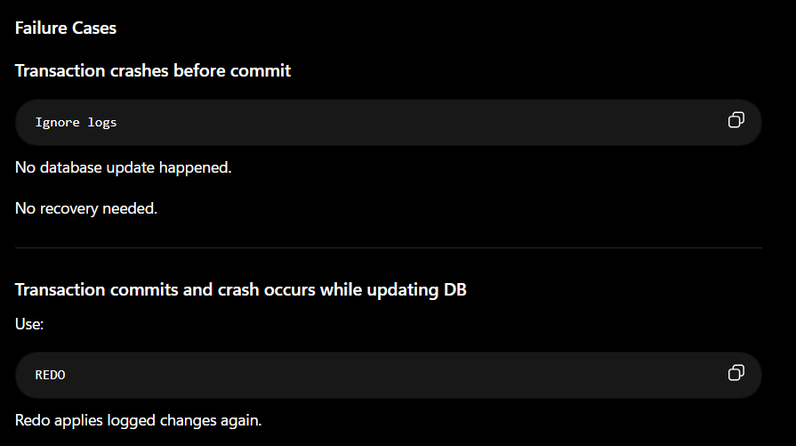
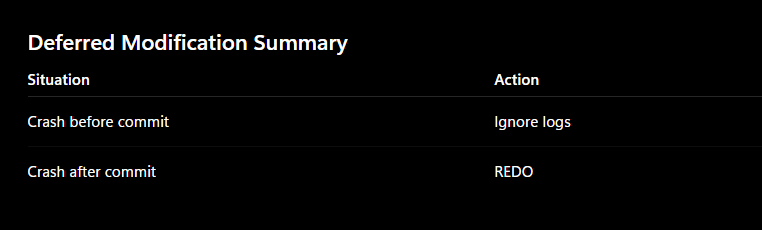
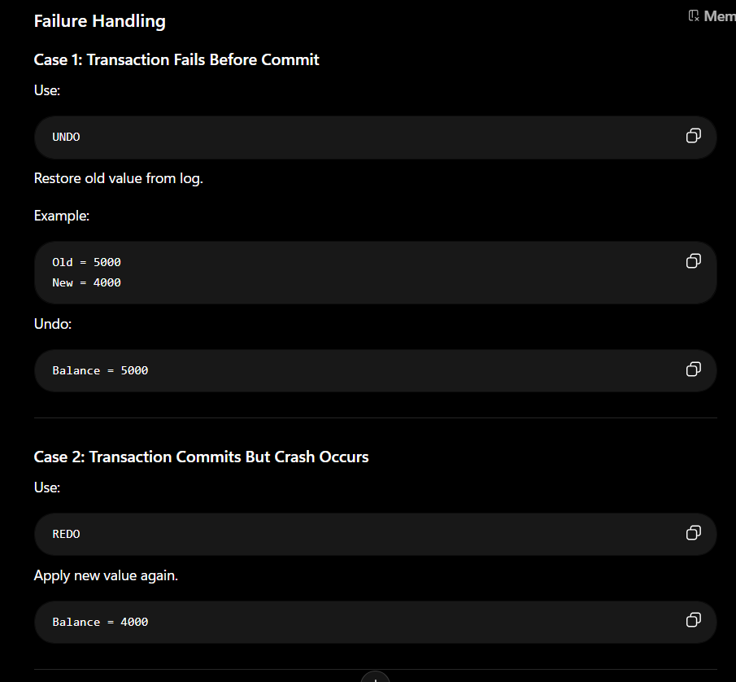

# How Atomicity and Durability are Implemented in DBMS

## Why do we need Recovery Mechanisms?
The Recovery Mechanism of DBMS ensures:
Atomicity → Either all operations of a transaction happen or none happen.
Durability → Once committed, changes remain permanent even after system crashes.
There are two main recovery techniques:
Shadow Copy Scheme
Log-Based Recovery

## Shadow Copy Scheme
Idea
Maintain two copies of the database:
- Original Database (Shadow Copy)
- New Updated Copy
A pointer called db-pointer always points to the current database.

How Atomicity is Achieved?
If failure occurs before db-pointer update:
Old DB remains unchanged
Delete new copy.
Result:
All changes applied OR No changes applied
Hence Atomicity.

How Durability is Achieved?
Case 1
Crash before db-pointer update:
System reads old DB
Transaction is ignored.
Case 2
Crash after db-pointer update:
System reads new DB
Changes remain permanent.
Hence Durability.

**Drawback**
Drawback
❌ Entire database is copied for every transaction.
Very inefficient for large databases.

## Log-Based Recovery
Maintain a Log File in stable storage.
A log contains records of all database operations.
Important Rule
Write log first, then update database.
This is called:
Write Ahead Logging (WAL)
Log Record Format
<Ti, Data_Item, Old_Value, New_Value>
Example:
<T1, Balance, 5000, 4000>

### Stable Storage
Stable storage guarantees:

Atomic writes
Recovery after crashes
Reliable storage of logs

### Types of Stable Storage
#### Deferred Database Modification
Idea
Do NOT immediately update the database.
Store all updates in the log.
Actual database updates happen only after transaction commits.

#### Immediate Database Modification
Database can be updated even before transaction commits.
Thus uncommitted data may exist in DB.
Example Log
<T1, Balance, 5000, 4000>
Store:
Old Value
New Value
Rule
Database update occurs only after corresponding log is safely written.
